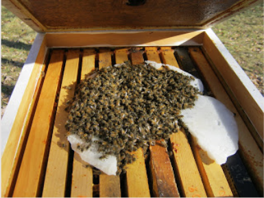
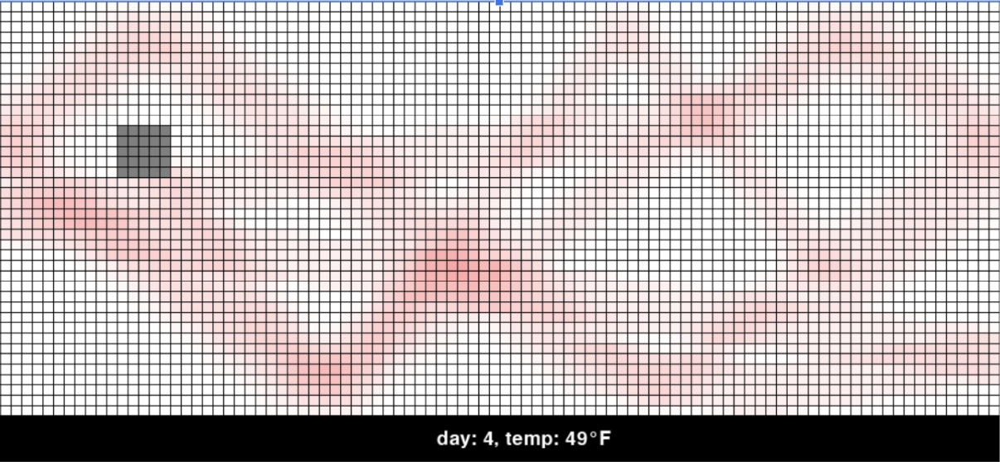
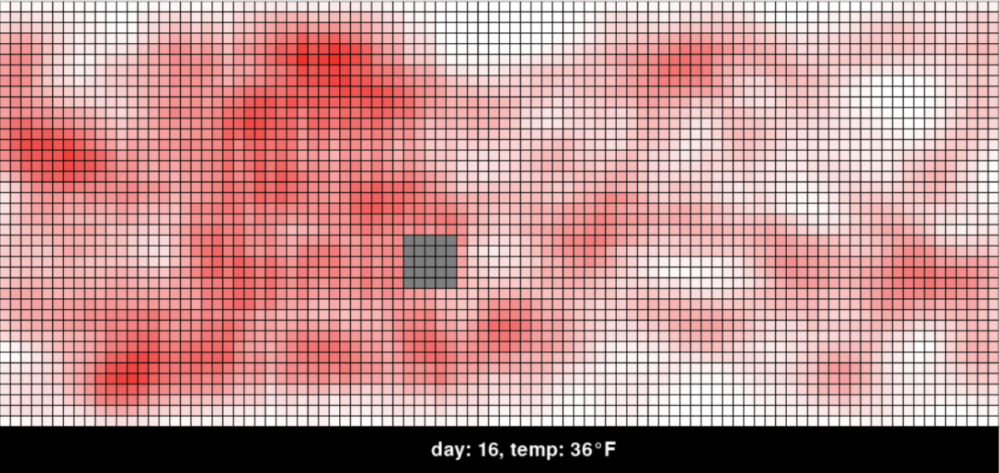

# ABM-Honey-Bee-Overwintering

*ABM-Honey-Bee-Overwintering* is an agent-based model written in Python 3.x, that simulates the expected survival of honey bees during the overwintering process.

## Preview of Model
What are Honey Bee Cluster Looks Like:  

Simulation:

## Dependencies
The following libraries and data are required to run the simulation:

- Libraries: NumPy, Pandas, PyGame, Random, sys, os, timeit
- Data: The excel file, 'temperature-data.csv'.

----
Copyright © 2020 Will Torres. All rights reserved. No warranty. This code is provided for reference only. You may republish any of this code verbatim with author and URL info intact. You need written permission from the author to make modifications to the code, include parts into your own work, etc.
